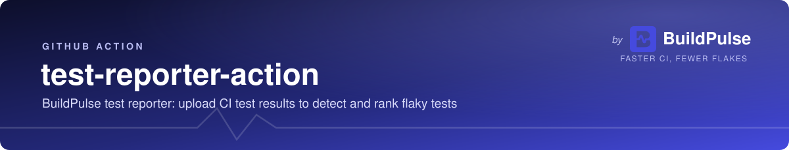

<a href="https://buildpulse.io"></a>

<a href="https://buildpulse.io/products/flaky-tests?ref=github-badge"></a>

GitHub Action that uploads test results from your CI pipeline to [BuildPulse](https://buildpulse.io) for flaky test detection and ranking.

## Quick Start

```yaml
steps:
  - name: Run tests
    run: pytest --junitxml=reports/junit.xml

  - name: Upload test results to BuildPulse
    if: '!cancelled()'
    uses: BuildPulseLLC/test-reporter-action@v3
    with:
      api-token: ${{ secrets.BUILDPULSE_API_TOKEN }}
      path: reports/junit.xml
```

Create an API token in your BuildPulse organization settings and store it as a repository secret. The repository is auto-detected from the GitHub Actions environment.

## What's New in v3

- **Secret masking**: `api-token`, `key`, and `secret` are masked in CI logs via `core.setSecret()` so they never leak even if a downstream tool prints the request body.
- **Streaming upload to S3**: large monorepo archives are streamed instead of buffered in memory; multi-GB uploads no longer pressure the runner.
- **Retries with exponential backoff**: transient 5xx and network errors retry automatically instead of failing the customer build on a single blip.
- **HTTPS enforced**: the action now refuses to send credentials to a non-HTTPS `api-host`.
- **Real test suite**: `npm test` exercises auth, archive, upload (with mocked S3), and metadata across GitHub Actions / Bitbucket Pipelines environments.
- **Removed unused vulnerable deps**: `fast-xml-parser` (critical CVE) and other unused packages dropped.

## Upgrading From v2 (`buildpulse/buildpulse-action`)

The action moved from `buildpulse/buildpulse-action` to `BuildPulseLLC/test-reporter-action`. To upgrade:

```diff
-  uses: buildpulse/buildpulse-action@v2
+  uses: BuildPulseLLC/test-reporter-action@v3
```

Most workflows need no other changes. Two notes:

- v3 runs on `node20`. If you use self-hosted runners, ensure they support `node20` (most do).
- API token auth (`api-token`) is now the recommended path. Legacy `key`/`secret` + `account`/`repository` inputs still work for existing customers.

## Wrap Mode (Pipeline Metrics)

Use the `command` input to let the action run your tests and capture CPU/memory metrics during execution. This helps surface flakiness caused by resource pressure (OOM, CPU saturation, slow I/O).

```yaml
steps:
  - name: Run tests & upload to BuildPulse
    if: '!cancelled()'
    uses: BuildPulseLLC/test-reporter-action@v3
    with:
      api-token: ${{ secrets.BUILDPULSE_API_TOKEN }}
      command: npm test
      path: reports/junit.xml
```

Examples across languages:

```yaml
# Go
command: go test ./... -v -count=1

# Python
command: pytest --junitxml=reports/junit.xml

# Java
command: mvn test

# Ruby
command: bundle exec rspec --format RspecJunitFormatter --out reports/junit.xml
```

In wrap mode:
- Test stdout/stderr streams through normally so you still see test output in your CI log
- Runner hardware specs (CPUs, memory, OS) are always captured
- CPU load + memory usage are sampled every second during the test command
- The action step fails if your test command exits non-zero
- Metrics show up on the test run detail page in BuildPulse

## Legacy: Access Key / Secret Authentication

For customers still on the legacy auth scheme:

```yaml
steps:
  - name: Upload test results to BuildPulse
    if: '!cancelled()'
    uses: BuildPulseLLC/test-reporter-action@v3
    with:
      account: <buildpulse-account-id>
      repository: <buildpulse-repository-id>
      path: reports/junit.xml
      key: ${{ secrets.BUILDPULSE_ACCESS_KEY_ID }}
      secret: ${{ secrets.BUILDPULSE_SECRET_ACCESS_KEY }}
```

New projects should use `api-token` instead.

## Inputs

| Input | Required | Description |
|-------|----------|-------------|
| `api-token` | Recommended | BuildPulse API token from organization settings |
| `path` | Yes | Path to JUnit XML file(s): file, directory, or glob |
| `account` | Legacy only | BuildPulse account ID |
| `repository` | Legacy only | BuildPulse repository ID |
| `key` | Legacy only | `BUILDPULSE_ACCESS_KEY_ID` |
| `secret` | Legacy only | `BUILDPULSE_SECRET_ACCESS_KEY` |
| `commit` | No | Commit SHA (default: `${{ github.sha }}`) |
| `repository-path` | No | Path to the git clone (default: `.`) |
| `coverage-files` | No | Coverage file paths (space-separated) |
| `tags` | No | Tags to apply to this test run (space-separated) |
| `command` | No | Test command to run in wrap mode (enables pipeline metrics) |
| `quota` | No | Quota ID to count this upload against |

## Outputs

| Output | Description |
|--------|-------------|
| `upload-id` | Unique identifier for this upload |
| `account-id` | BuildPulse account ID |
| `repository-id` | BuildPulse repository ID |
| `command-exit-code` | Exit code of the test command (set only in wrap mode) |

## Development

```bash
npm install
npm test          # runs the Jest suite
npm run build     # rebuilds dist/ via @vercel/ncc
npm run lint      # ESLint over src/
```

### Source Files

| File | Purpose |
|------|---------|
| `src/index.js` | Entry point: orchestrates the upload flow |
| `src/archive.js` | Packages test result files into a tar.gz archive |
| `src/upload.js` | Streams the archive to S3 via a signed URL, with retries |
| `src/auth.js` | API token + legacy key/secret authentication |
| `src/metadata.js` | Collects Git metadata (GitHub Actions + Bitbucket Pipelines) |
| `src/sampler.js` | CPU/memory resource sampler used in wrap mode |
| `action.yml` | GitHub Action definition (inputs, outputs, runs) |

The committed `dist/index.js` must stay in sync with `src/`. If you change `src/`, re-run `npm run build` and commit `dist/` in the same PR.

## Writing for this repo

This repository is public and this README is the first thing a prospective user reads, so its prose follows [EXTERNAL-VOICE.md](EXTERNAL-VOICE.md).

The short version: no em-dashes. Rewrite with a full stop, a colon, parentheses, or a comma depending on what the dash was doing, and never a spaced hyphen. The same rule covers the action description in `action.yml` and any log line the action prints into a user's CI output.

## License

MIT. See [LICENSE](LICENSE).
